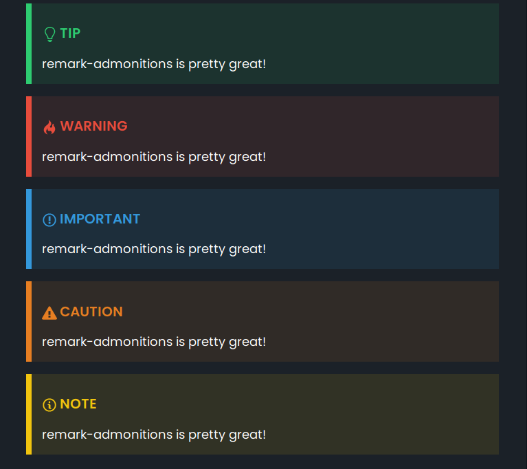

# gatsby-remark-admonitions

This is a Gatsby plugin for the [`remark-admonitions` plugin](https://github.com/elviswolcott/remark-admonitions).



## How to use

### Install

Install the package with `npm`.

```bash
# with npm
npm i gatsby-remark-admonitions

# or with yarn
yarn add gatsby-remark-admonitions
```

### Usage

To use the plugin add it to your `gatsby-config.js`:

```js
{
  resolve: `gatsby-remark-admonitions`,
  options: {
    customTypes: {
      custom: {
        keyword: "test",
        emoji: '💻',
        svg: '<svg xmlns="http://www.w3.org/2000/svg" width="16" height="16" viewBox="0 0 16 16"><path fill-rule="evenodd" d="M15 2H1c-.55 0-1 .45-1 1v9c0 .55.45 1 1 1h5.34c-.25.61-.86 1.39-2.34 2h8c-1.48-.61-2.09-1.39-2.34-2H15c.55 0 1-.45 1-1V3c0-.55-.45-1-1-1zm0 9H1V3h14v8z"></path></svg>'
      },
    },
    tag: ":::",
    icons: "svg",
  }
},
```

| Prop        | Required |                   Type | Description                                                     |
| ----------- | :------: | ---------------------: | --------------------------------------------------------------- |
| customTypes |  false   |            customTypes | This option can be used to add additional types of admonitions. |
| tag         |  false   |                 string | The tag used for creating admonitions, defaults to `:::`.       |
| icons       |  false   | `"svg"|"emoji"|"none"` | The type of icon to use, defaults to `svg`.                     |

Where the `customTypes` is defined as:

```ts
const customTypes = {
  [string: keyword]: {
    ifmClass: string,
    keyword: string,
    emoji: string,
    svg: string,
  } | string
}
```

#### CSS Styles

You will also need to import the css styles to style your admonitions. You can do this where ever you want but if
you need the styles globally import then into `gatsby-browser.js`

```js
//gastby-browser.js
import "remark-admonitions/styles/classic.css";
```

### Examples

Using the default options you can add admonitions to your markdown files like so:

```md
:::keyword title
Contents
:::
```

Where default keywords you can use include the following `tip`, `warning`, `caution`, `note` & `important`

```md
:::tip pro tip
remark-admonitions is pretty great!
:::
```

You can include any markdown component within the admonitions (except another admonition).

````md
:::note This includes code

\```bash
ls -l
\```
:::
````

You can view more examples in the `examples/README.md` file.
